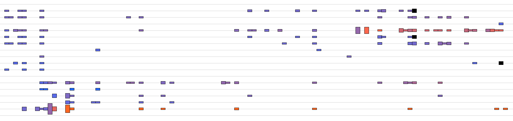
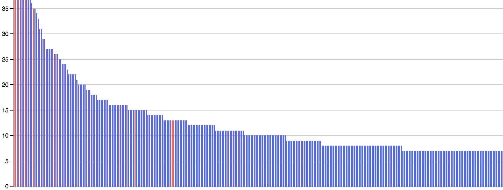
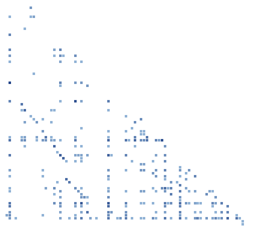

# Churn Charts

Visualisations to analyse code churn based on Git logs

## Timeline

  
    
The chart has a row per file, showing the code churn on a daily basis. Churn in this context is simply the number of lines of code added and deleted. Bars are only shown for days on which the file was changed.

The more lines of code added and/or deleted the higher the bar for that day. The colour of the bar changes from blue to red based on how much churn there was relative to the estimated file size. The lowest value is 1, which means that all lines were just added and then never touched again. There is (obviously) no upper limit but in the chart the 'reddest' colour is shown when the aggregated churn is at least 10 times as big as the estimated size of the file, ie. when each line of the file has been touched (on average) ten times.

More information is available by hovering over the idividual boxes. The filename shown is the name of the file on that day. It can change over time when the file gets renamed.

## Histogram

Histogram for the number of commits per file, sorted, from left to right, by number of commits.

The colour of the bar changes from blue to red based on how much churn, in terms of lines added/deleted, there was for that file.

Michael Feathers describes this chart in his article [Getting Empirical about Refactoring](http://www.stickyminds.com/article/getting-empirical-about-refactoring)

## Matrix

Matrix view that shows which files are commited together frequently.

Each square in the diagram represents a pair of files. The colour of the square gets darker the more often the corresponding files are found together in a commit. If two files are never found together in a commit or if there is only one commit in which the two files are found together, no square is drawn.

Information about the files is available by hovering over the squares. The weight is currently simple the count of commits in which the two files are found together.

## Running the visualisations

Create the Git log as follows and copy the `gitlog.txt` file into the root directory of this app. The file is in `.gitignore` already.

    git log --reverse --all -M -C --numstat --format="--%ct--%cI--%cn%n" > gitlog.txt
    

Then run the `app.rb` script

    ./app.rb
    
or, using the rerun gem:

    rerun 'ruby app.rb' 

Connect to the webserver, which is usually running on [http://localhost:4567](http://localhost:4567)

    
    